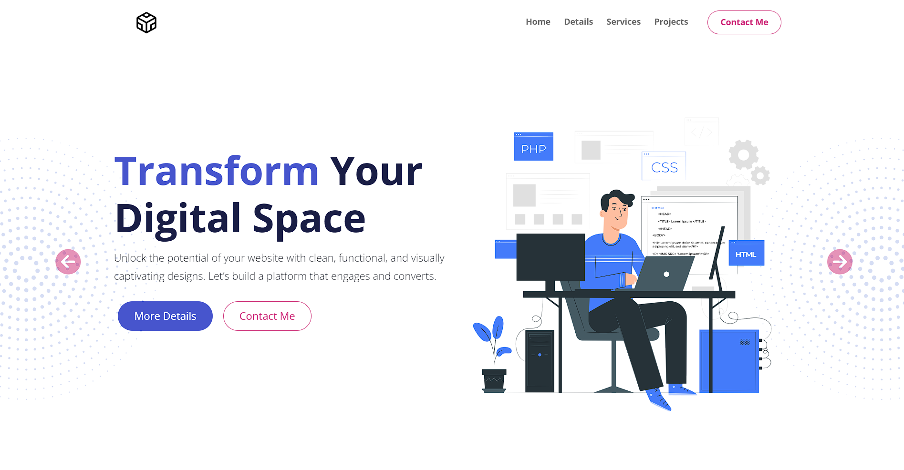

# Portfolio Website

Bootstrap website for a company that creates and customizes office spaces. It could be used for just about any kind of business. It is a very light business theme with a clean design.



## Features

- Clean design with background images/patterns
- Responsive design
- Custom JavaScript for the stat counter
- Nav scroll effect
- Project area
- Testimonial slider/carousel
- Contact form
- Inner article page
- Font awesome icons

## Usage

This website is built with [Bootstrap](https://getbootstrap.com/) and [Sass](https://sass-lang.com/). It uses [Font Awesome](https://fontawesome.com/) for icons.

In order to customize this website, you need to install [Node.js](https://nodejs.org/en/). Then, clone this repository and run:

```bash
npm install
```

This will install Bootstrap, Sass and Font Awesome. To build your CSS files from Sass, run:

```bash
npm run sass:build
```

To watch your Sass files for changes, run:

```bash
npm run sass:watch
```


